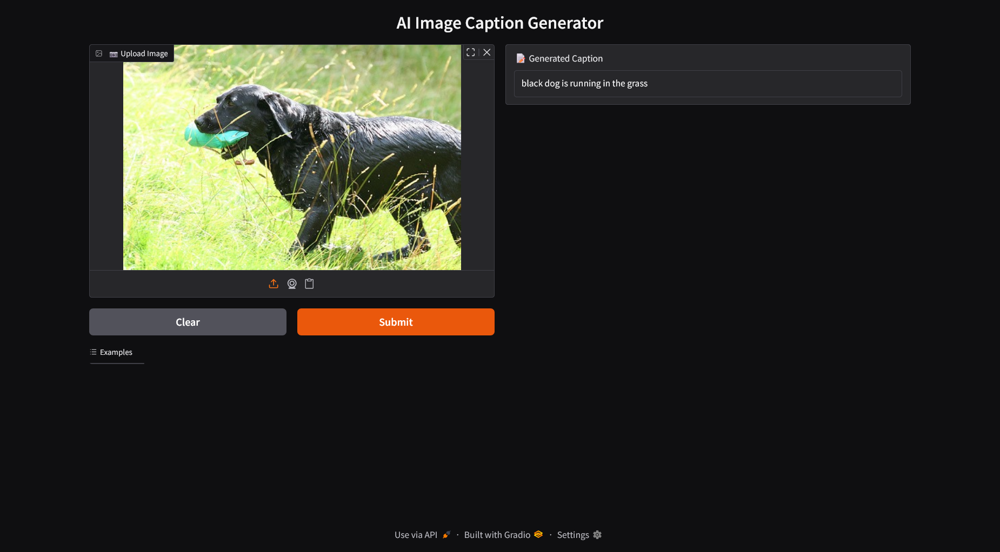

# KAPTION: Image Caption Generator

KAPTION is a deep learning project that generates natural language captions for images using a CNN-LSTM architecture. The project includes a Gradio-powered web interface for easy image upload and caption generation.

---



## **Project Structure**

```
KAPTION/
│
├── assets/
│   ├── img1.jpg
│   ├── img2.jpg
│   ├── img3.jpg
│   ├── img4.jpg
│   └── img5.jpg
│
├── app.py
├── feature_extractor.keras
├── kaption.png
├── main.ipynb
├── model.keras
├── presentation.pdf
├── report.pdf
└── tokenizer.pkl
```

---

## **Files and Folders**

- **assets/**: Contains sample images for testing the caption generator.
- **app.py**: Main application script. Runs the Gradio web interface for image captioning.
- **feature_extractor.keras**: Pre-trained CNN model for extracting image features.
- **kaption.png**: Project logo or banner image.
- **main.ipynb**: Jupyter notebook with code for data preprocessing, model training, and evaluation.
- **model.keras**: Trained caption generation model (CNN-LSTM).
- **presentation.pdf**: Project presentation slides.
- **report.pdf**: Detailed project report.
- **tokenizer.pkl**: Serialized tokenizer used for processing captions.

---

## **How It Works**

1. **Upload an image** via the Gradio web interface.
2. The **feature extractor** processes the image to generate feature vectors.
3. The **caption model** uses these features to generate a descriptive caption, word by word.
4. The generated caption is displayed in the web interface.

---

## **How to Run**

1. **Install dependencies** (Python 3.7+, TensorFlow, Gradio, Pillow, numpy).
   ```
   pip install tensorflow gradio pillow numpy
   ```
2. **Run the app**:
   ```
   python app.py
   ```
3. **Open the provided URL** in your browser to access the web interface.

---

## **Usage**

- Upload any image or use the sample images in the `assets/` folder.
- The app will display a generated caption for the image.
- Use the interface for quick demos or testing.

---

## **Project Files**

- **main.ipynb**: For training, evaluation, and experimentation.
- **app.py**: For deployment and user interaction.
- **presentation.pdf** and **report.pdf**: For documentation and project overview.

---
